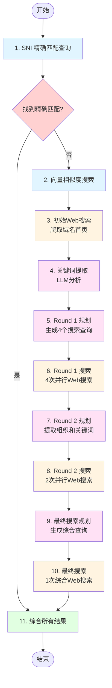
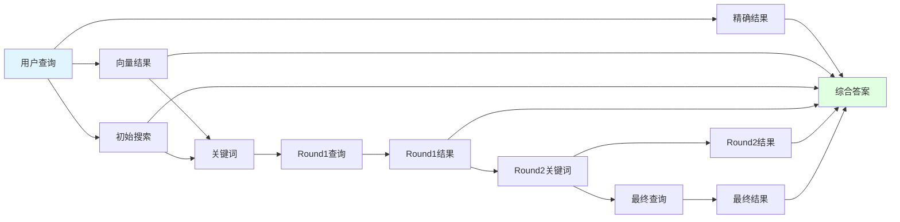
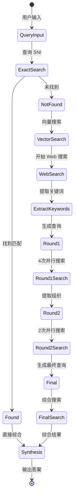
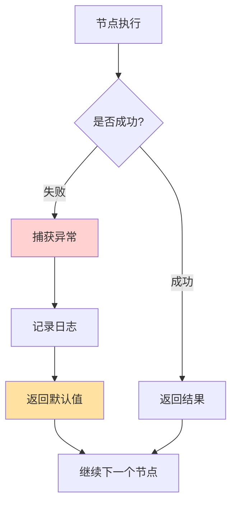
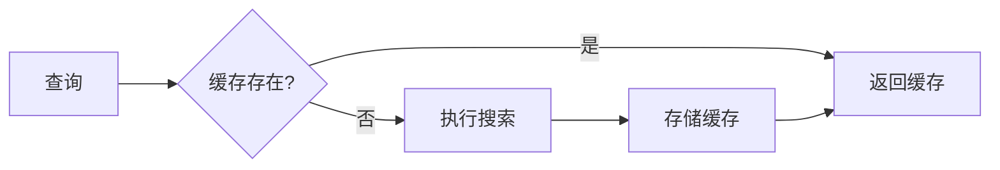
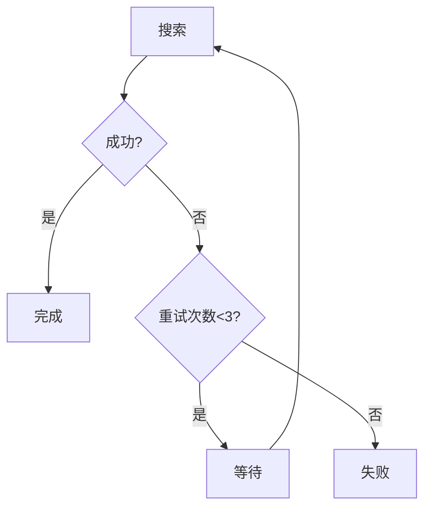
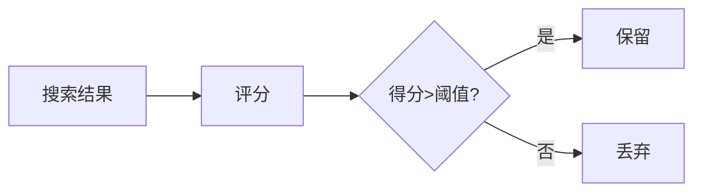

# SNI Search 工作流可视化

本文档展示了 SNI Search 系统的完整 LangGraph 工作流程。

## 完整工作流图



### 图例说明

- 🔵 **蓝色**: 数据库查询节点
- 🟡 **黄色**: Web 搜索节点
- 🟣 **紫色**: LLM 处理节点
- 🟢 **绿色**: 结果综合节点
- 🔴 **红色**: 条件判断节点

## 节点详细说明

### 1. SNI 精确匹配查询
- **输入**: 用户查询的 SNI 域名
- **处理**: 在 Qdrant 数据库中查找精确匹配
- **输出**: `sni_exact_results`

### 2. 向量相似度搜索
- **输入**: 用户查询
- **处理**: 使用 embedding 查找相似 SNI
- **输出**: `sni_vector_results` (Top 5)

### 3. 初始 Web 搜索
- **输入**: SNI 域名
- **处理**: 爬取 `https://{sni}` 或 `http://{sni}` 首页
- **输出**: `initial_search_result` (页面内容)

### 4. 关键词提取
- **输入**: 向量搜索结果 + 初始Web搜索内容
- **处理**: LLM 分析并提取关键词
- **输出**: `extracted_keywords`, `enhanced_query`

### 5. Round 1 规划
- **输入**: 提取的关键词
- **处理**: LLM 生成 4 个不同角度的搜索查询
  - 技术细节查询
  - 服务信息查询
  - 基础设施查询
  - 安全相关查询
- **输出**: `round1_queries` (4个查询)

### 6. Round 1 搜索
- **输入**: 4 个搜索查询
- **处理**: 并行执行 4 次 Web 搜索
- **并发控制**: Semaphore(4)
- **输出**: `round1_results`

### 7. Round 2 规划
- **输入**: Round 1 搜索结果
- **处理**: LLM 分析识别组织机构，生成 2 个精准查询
- **输出**: `round2_keywords` (2个关键词)

### 8. Round 2 搜索
- **输入**: 2 个精准关键词
- **处理**: 并行执行 2 次 Web 搜索
- **输出**: `round2_results`

### 9. 最终搜索规划
- **输入**: Round 2 关键词 + 原始查询
- **处理**: LLM 生成综合验证查询
- **输出**: `final_search_query`

### 10. 最终搜索
- **输入**: 最终查询
- **处理**: 执行综合 Web 搜索
- **输出**: `final_search_result`

### 11. 综合所有结果
- **输入**: 所有前序节点的结果
- **处理**: LLM 综合分析所有数据源
- **输出**: `final_answer` (JSON 格式)

## 数据流图



## 并行执行流程

```mermaid
gantt
    title SNI Search 执行时间线
    dateFormat X
    axisFormat %s

    section 数据库查询
    精确匹配    :0, 1
    向量搜索    :1, 2

    section 初始搜索
    爬取首页    :2, 4

    section LLM 处理
    关键词提取  :4, 6
    Round1规划  :6, 8

    section Round 1
    搜索1       :8, 10
    搜索2       :8, 10
    搜索3       :8, 10
    搜索4       :8, 10

    section LLM 处理
    Round2规划  :10, 12

    section Round 2
    搜索5       :12, 14
    搜索6       :12, 14

    section LLM 处理
    最终规划    :14, 16

    section 最终搜索
    搜索7       :16, 18

    section 综合
    生成答案    :18, 20
```



## 搜索策略分析

### 搜索轮次分布

| 轮次 | 数量 | 目的 | 并发 |
|------|------|------|------|
| 初始搜索 | 1 | 直接获取首页信息 | ❌ |
| Round 1 | 4 | 多角度探索 | ✅ |
| Round 2 | 2 | 精准定位 | ✅ |
| Final | 1 | 综合验证 | ❌ |
| **总计** | **8** | - | - |

### 查询策略演进

```
查询: "tclandroidicsapp.accu-weather.com"

↓ 提取关键词
Keywords: ["AccuWeather", "Android", "mobile app", "weather API"]

↓ Round 1: 多角度探索
Query 1: "AccuWeather Android app technical architecture"
Query 2: "AccuWeather mobile API service information"
Query 3: "AccuWeather app infrastructure domain"
Query 4: "AccuWeather API security and protocols"

↓ Round 2: 精准定位
Keyword 1: "AccuWeather Android ICS application"
Keyword 2: "tclandroid subdomain AccuWeather"

↓ Final: 综合验证
Final Query: "tclandroidicsapp.accu-weather.com AccuWeather Android app service"
```

## 状态转换图



## 错误处理流程



## 性能指标

### 典型执行时间

- **数据库查询**: ~0.1s (精确) + ~0.3s (向量)
- **初始搜索**: ~2s (爬取首页)
- **LLM 处理**: ~1-2s (每次)
- **Web 搜索**: ~1-2s (每次)
- **Round 1 并行**: ~2s (4次并发)
- **Round 2 并行**: ~2s (2次并发)
- **最终搜索**: ~2s
- **综合答案**: ~2-3s

**总计**: 约 15-20 秒

### 优化点

1. **并行执行**: Round 1 和 Round 2 使用并发
2. **结果缓存**: 相同查询不重复搜索
3. **超时控制**: 每个搜索设置 timeout
4. **异步 I/O**: 使用 asyncio 提升效率

## 扩展方向

### 1. 添加缓存层



### 2. 实现重试机制



### 3. 添加结果评分



---

## 参考

- 详细文档: [langgraph-architecture.md](./langgraph-architecture.md)
- 快速入门: [langgraph-quickstart.md](./langgraph-quickstart.md)
- 源代码: `src/graph/`
